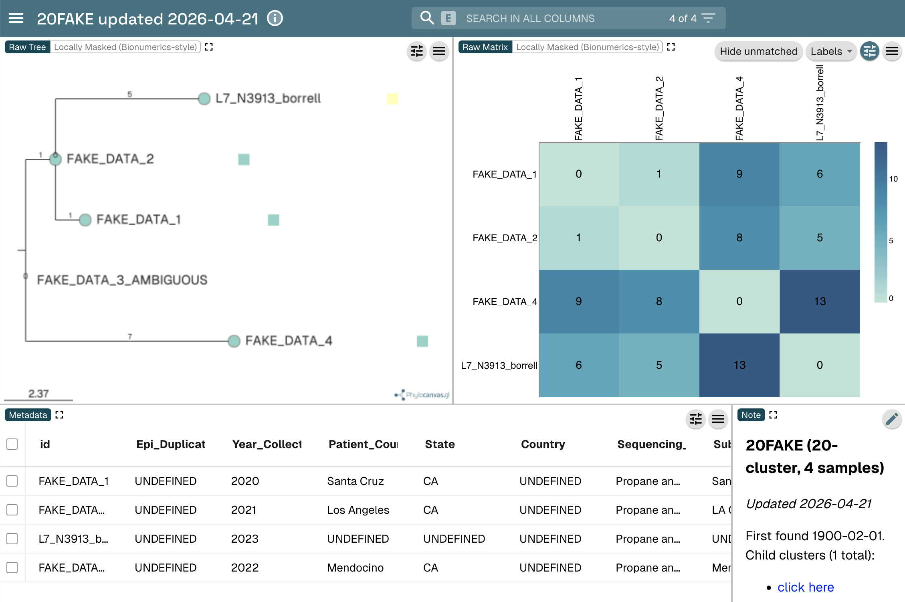

# microreact sample-is-missing behavior

If a sample is present in the distance matrix, and present on the nwk, but not in the metadata CSV, it will appear on the tree but disappear from the distance matrix.

